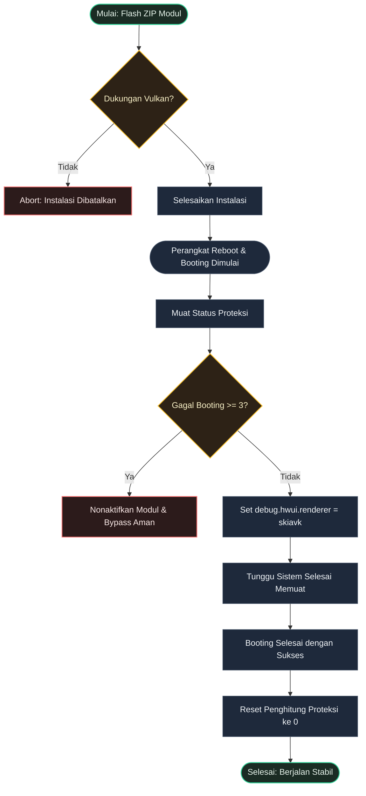

# SkiaVK

<p align="center">
  
</p>

<p align="center">
  <strong>Memaksa rendering Skia Vulkan di Android dengan perlindungan bootloop otomatis berbasis atomic.</strong>
</p>

<p align="center">
  
  
  
  
  <br>
  <br>
  <a href="README.md">English</a> | <a href="README.id.md">Bahasa Indonesia</a>
</p>

## Deskripsi Umum

SkiaVK mengubah renderer bawaan HWUI dari OpenGL ke Vulkan untuk menghasilkan animasi antarmuka yang lebih lancar, rendah latensi, dan optimalisasi penggunaan akselerasi hardware GPU pada perangkat yang kompatibel.

---

## Mengapa Memilih SkiaVK?

- **UI Jauh Lebih Mulus**: Memaksa penggunaan Vulkan untuk animasi yang lebih cepat dan mengurangi lag pada GPU.
- **Proteksi Bootloop Aman**: Mematikan modul secara otomatis jika gagal booting 3 kali berturut-turut dengan sistem tulis berkas yang aman (atomic).
- **Pemulihan Sekali Ketuk**: Aktifkan kembali modul dan reset penghitung bootloop cukup dengan menekan tombol **Action** di manajer KernelSU/APatch.

---

## Bukti Uji Coba

Telah diuji dan diverifikasi pada **Samsung Galaxy S23 (Snapdragon 8 Gen 2)** dengan KernelSU-Next. Berikut adalah tangkapan layar **GPUWatch** yang menampilkan pipa rendering Vulkan (`skiavk`) aktif beserta status modul yang terpasang:

<p align="center">
  
</p>

---

## Persyaratan Sistem

| Persyaratan | Detail |
|-------------|--------|
| Android | 10.0+ (API 29+) |
| Perangkat Keras | Perangkat dengan driver Vulkan yang mendukung akselerasi GPU |
| Root | Magisk, KernelSU, atau APatch |

---

## Instalasi & Konfigurasi

1. Unduh berkas `SkiaVK.zip` terbaru dari halaman [Releases](https://github.com/dyokism/SkiaVK/releases).
2. Pasang berkas ZIP melalui tab **Modules** di manager root Anda.
3. **Reboot** (Mulai ulang) perangkat Anda untuk mengaktifkan.
4. Periksa berkas log di: `/data/adb/skia_vulkan/skia_vulkan.log`

---

## Struktur Berkas

```text
SkiaVK/
├── META-INF/
│   └── com/
│       └── google/
│           └── android/
│               ├── update-binary
│               └── updater-script
├── action.sh        # mengatur ulang penghitung bootloop (KSU/APatch Action)
├── customize.sh     # pemeriksaan kompatibilitas & Vulkan driver saat instalasi
├── module.prop      # metadata modul
├── post-fs-data.sh  # injeksi properti awal booting & proteksi bootloop
├── service.sh       # late-boot watchdog & pengembalian renderer jika diubah vendor
├── uninstall.sh     # menghapus berkas sisa saat modul dihapus
└── util.sh          # fungsi utilitas dan variabel bersama
```

---

## Cara Kerja



---

## Pengembang, Kredit & Lisensi

- **Pengembang**: [dyokism](https://github.com/dyokism)
- **Lisensi**: [MIT](LICENSE)
- **Kredit & Apresiasi**:
  - **Vulkan API** oleh [The Khronos Group](https://www.vulkan.org/)
  - **Manajer Root**: [Magisk](https://github.com/topjohnwu/Magisk), [KernelSU](https://github.com/tiann/KernelSU), dan [APatch](https://github.com/bmax121/APatch)
  - **Samsung GPUWatch** sebagai alat bantu debugging performa grafis
