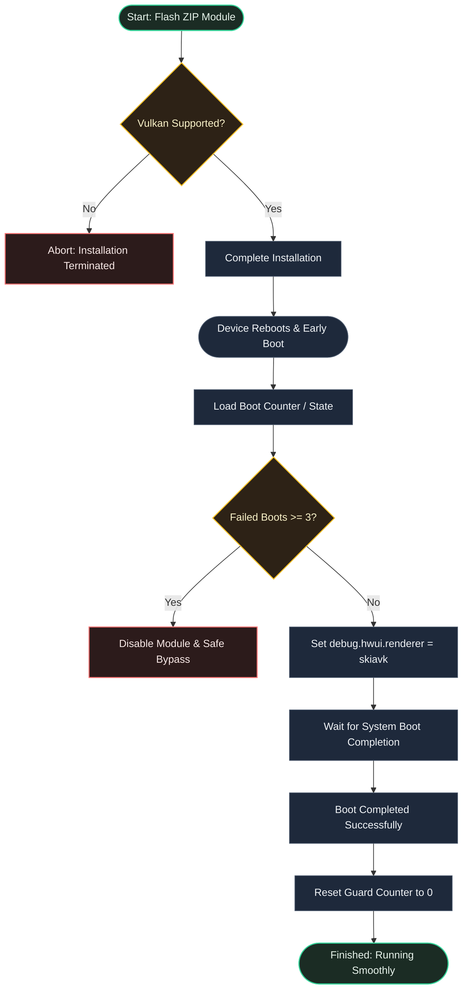

[English](README.md) | [Bahasa Indonesia](README.id.md)

# SkiaVK

**Forces Skia Vulkan rendering on Android with built-in atomic bootloop protection.**


## Overview

SkiaVK changes the default HWUI renderer from OpenGL to Vulkan. This provides smoother UI rendering, reduced animation latency, and better GPU hardware utilization on compatible devices.

---

## Why Use SkiaVK?

- **Butter-Smooth UI**: Forces Vulkan rendering for faster animations and less GPU lag.
- **Fail-Safe Bootloop Guard**: Automatically disables the module after 3 failed boot attempts using safe, atomic file updates.
- **Easy Recovery**: Re-enable the module and reset the safety counter with a single tap of the **Action** button in KernelSU/APatch.

---

## Requirements

| Requirement | Details |
|-------------|---------|
| Android | 10.0+ (API 29+) |
| Hardware | Device with Vulkan driver and hardware support |
| Root | Magisk, KernelSU, or APatch |

---

## Installation & Configuration

1. Install the ZIP file via your root manager's **Modules** tab.
2. **Reboot** your device to activate.
3. Check logs at: `/data/adb/skia_vulkan/skia_vulkan.log`

---

## File Structure

```text
SkiaVK/
├── META-INF/
│   └── com/
│       └── google/
│           └── android/
│               ├── update-binary
│               └── updater-script
├── action.sh        # resets bootloop counter (KSU/APatch Action)
├── customize.sh     # install-time compatibility checks & Vulkan check
├── module.prop      # module metadata properties
├── post-fs-data.sh  # early boot property injection & bootloop guard
├── service.sh       # late boot completion watchdog & override recovery
├── uninstall.sh     # clean up persistent data on uninstall
└── util.sh          # shared helper functions & variables
```

---

## How It Works



---

## Developer & License

- **Developer**: [dyokism](https://github.com/dyokism)
- **License**: MIT
