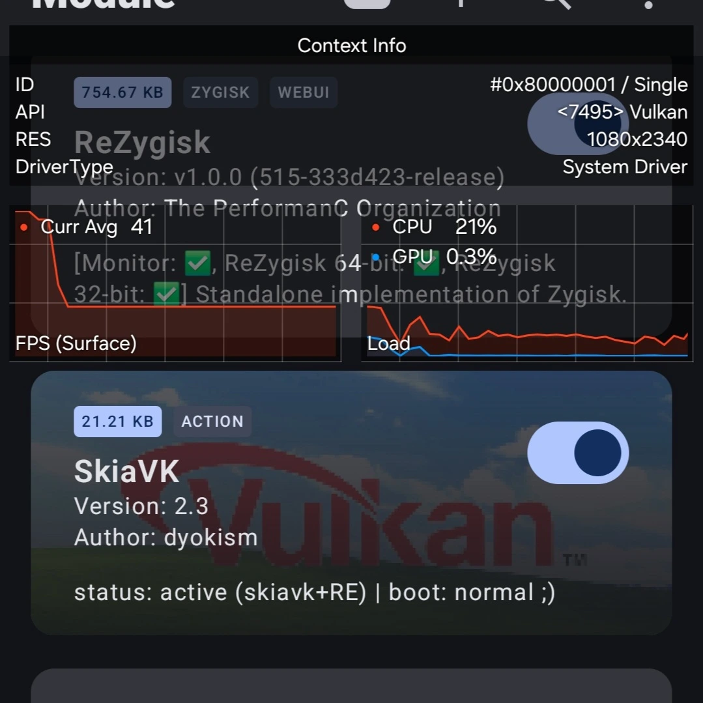

# SkiaVK

<p align="center">
  
</p>

<p align="center">
  <strong>Forces Skia Vulkan rendering on Android with built-in atomic bootloop protection.</strong>
</p>

<p align="center">
  
  
  
  
  <br>
  <br>
  <a href="README.md">English</a> | <a href="README.id.md">Bahasa Indonesia</a>
</p>

## Overview

SkiaVK changes the default HWUI renderer from OpenGL to Vulkan. This provides smoother UI rendering, reduced animation latency, and better GPU hardware utilization on compatible devices.

---

## Why Use SkiaVK?

- **Butter-Smooth UI**: Forces Vulkan rendering for faster animations and less GPU lag.
- **Fail-Safe Bootloop Guard**: Automatically disables the module after 3 failed boot attempts using safe, atomic file updates.
- **Easy Recovery**: Re-enable the module and reset the safety counter with a single tap of the **Action** button in your root manager.
- **Software Vulkan Protection**: Automatically aborts installation on emulators, virtual machines, or devices running software Vulkan renderers (e.g. SwiftShader, Lavapipe) to prevent GUI freezes.

---

## Verification

Verified and tested on **Samsung Galaxy S23 (Snapdragon 8 Gen 2)** running KernelSU-Next. Below is the GPUWatch overlay showing the active Vulkan (`skiavk`) rendering pipeline and module status:

<p align="center">
  
</p>

---

## Requirements

| Requirement | Details |
|-------------|---------|
| Android | 10.0+ (API 29+) |
| Hardware | Device with Vulkan driver and hardware support |
| Root | Magisk, KernelSU, or APatch |

---

## Installation & Technical Configuration

1. Download the latest `SkiaVK.zip` from [Releases](https://github.com/dyokism/SkiaVK/releases).
2. Install the ZIP file via your root manager's **Modules** tab.
3. **Reboot** your device to activate.

### Technical Configuration

SkiaVK operates via property injection. The core persistent state is maintained in `/data/adb/skia_vulkan/`. 
- **Log File**: `/data/adb/skia_vulkan/skia_vulkan.log` (overwritten automatically per boot cycle).
- **Boot State**: `/data/adb/skia_vulkan/boot_state` (tracks the bootloop counter).

**Properties Injected (Early Boot):**
- `debug.hwui.renderer=skiavk` (Default)

#### RenderEngine Opt-In Feature
You can optionally force the **SurfaceFlinger RenderEngine** backend to also use Vulkan (`debug.renderengine.backend=skiavk`). 

> [!WARNING]
> RenderEngine Vulkan backend is highly experimental on some Android versions/ROMs and might cause UI glitches or screen flickering. Use with caution.

* **Enable RenderEngine**: 
  ```bash
  su -c "touch /data/adb/skia_vulkan/enable_renderengine"
  ```
* **Disable RenderEngine**: 
  ```bash
  su -c "rm -f /data/adb/skia_vulkan/enable_renderengine"
  ```
  *(A device reboot is required to apply the RenderEngine changes)*

---

## File Structure

```text
SkiaVK/
├── META-INF/
│   └── com/
│       └── google/
│           └── android/
│               ├── update-binary
│               └── updater-script
├── action.sh        # resets bootloop counter (KSU/APatch Action)
├── customize.sh     # install-time compatibility checks & Vulkan check
├── module.prop      # module metadata properties
├── post-fs-data.sh  # early boot property injection & bootloop guard
├── service.sh       # late boot completion watchdog & override recovery
├── uninstall.sh     # clean up persistent data on uninstall
└── util.sh          # shared helper functions & variables
```


---

## Developer, Credits & License

- **Developer**: [dyokism](https://github.com/dyokism)
- **License**: [MIT](LICENSE)
- **Credits & Acknowledgements**:
  - **Vulkan API** by [The Khronos Group](https://www.vulkan.org/)
  - **Root Managers**: [Magisk](https://github.com/topjohnwu/Magisk), [KernelSU](https://github.com/tiann/KernelSU), and [APatch](https://github.com/bmax121/APatch)
  - **Samsung GPUWatch** for performance debugging tools
